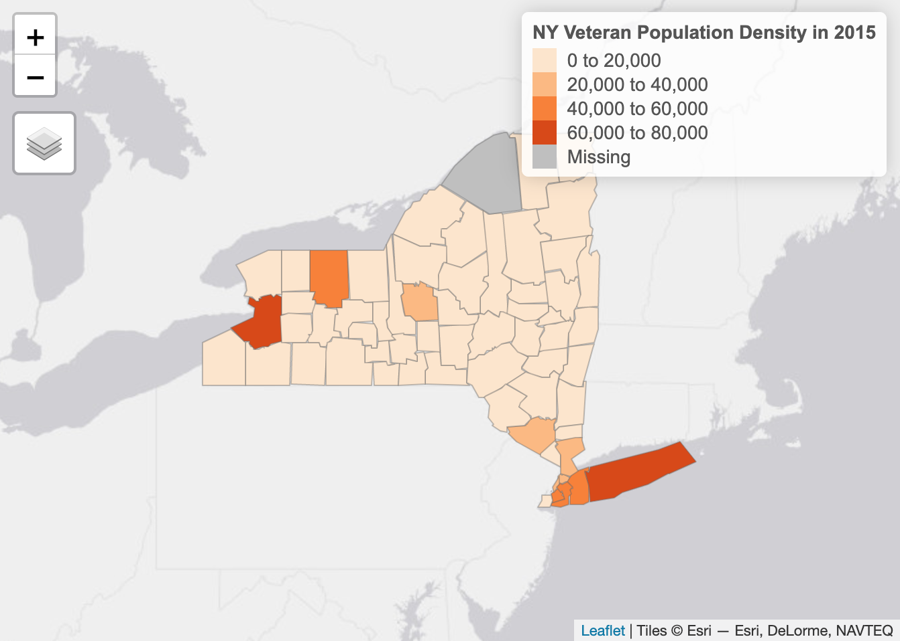
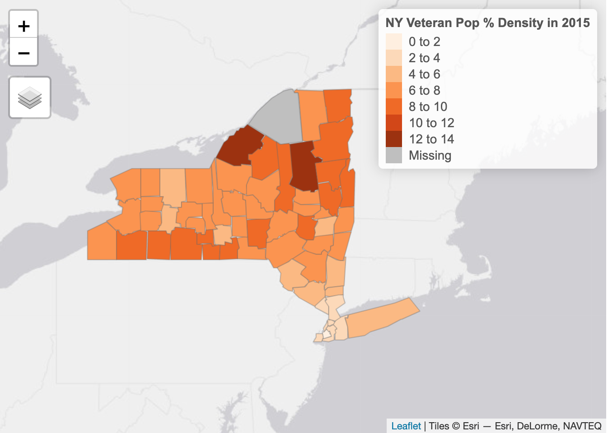

---
authors:
- admin
date: "2018-11-30T00:00:00-04:00"
draft: false
image:
  focal_point: "Smart"
  preview_only: false
lastmod: ""
subtitle: 'A quick demographic study of veterans across the United States and New York.'
summary: Drawing insights on population through data visualization.
title: 'Visualizing Veteran Population'
reading_time: true
categories: ["Data Visualization", "GIS", "Maps"]
---

I was curious to know what the veteran population was like in the United States, so I went onto the [Department of Veterans Affairs website](https://www.va.gov/vetdata/veteran_population.asp) and found a bunch of spreadsheets and pivot tables on veteran population. The data is given in county format, which is good for our analysis later, but we need to aggregate it to look at it in a state level.

## <b>US Veteran Population Density in 2015</b>

Here is a breakdown of veteran popuulation density across the US in 2015. We can see that most veterans live in California, Texas, and Florida.

 
## <b>New York Veteran Population Density in 2015</b>

Now that we have an idea of the veteran population in the US, lets look more closely at a particular state to see if we can draw any insights on this dataset. The above map shows a raw count of veterans in New York. Suffolk county and Erie county have the most veterans. However, this map can be a little misleading. There are a lot of veterans living in these counties but we do not know anything about the overall population density in each county. Let's take some [census data](https://www.census.gov/programs-surveys/geography.html) and build out veteran proportion in each country.

 
## <b>New York Veteran Population by percentage</b>

Now we can see taht Jefferson and Hamilton county have the most veterans by percentage of population within the county. A little Google search found that a VA in both Hamilton County and Jefferson County!
 
[VA in Hamilton County](https://veterans.ny.gov/content/hamilton-county-veterans-service-agency-location-1) 
[VA in Jefferson County](https://co.jefferson.ny.us/departments/Veterans)

 

## <b>Impotance of Visualization</b>
Visualizing this dataset helped understand areas with the highest proportion of veterans does not happen by chance. More veterans will live nearby a VA.  I think this approach would be useful for the VA if they have plans to build new VA hospitals or offices that provide benefits to veterans.

 
## Resources:  
https://www.census.gov/geo/maps-data/data/cbf/cbf_state.html  
http://gis.ny.gov/gisdata/inventories/details.cfm?DSID=927  
https://www.va.gov/vetdata/

## Interesting Reading:  
https://www.osc.state.ny.us/reports/other/veterans_11_2015.pdf  
https://www.syracuse.com/state/index.ssf/2015/11/nys_veterans_where_they_live_when_they_served.html  