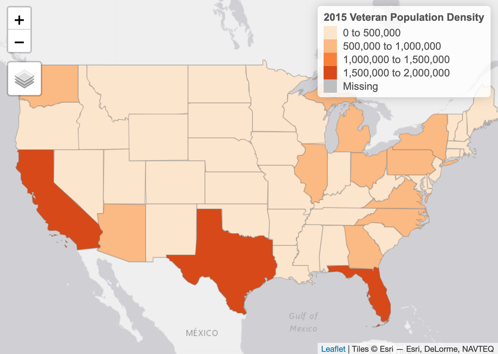

---
authors:
- admin
date: "2018-11-30T00:00:00-04:00"
draft: true
image:
  focal_point: "Smart"
  preview_only: false
lastmod: ""
subtitle: 'A quick demographic study of veterans across the United States and New York.'
summary: Drawing insights on population through data visualization.
title: 'Visualizing Veteran Population'
reading_time: true
categories: ["Data Visualization", "GIS", "Maps"]
---

I was curious to know what the veteran population was like in the United States, so I went onto the [Department of Veterans Affairs website](https://www.va.gov/vetdata/veteran_population.asp) and found a bunch of spreadsheets and pivot tables on veteran population.

